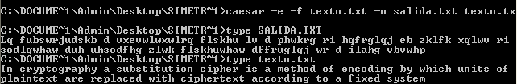
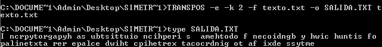
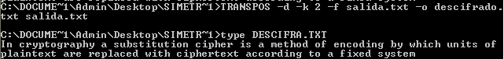
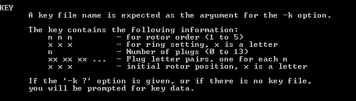
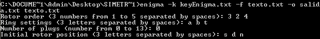
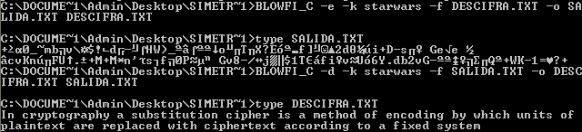
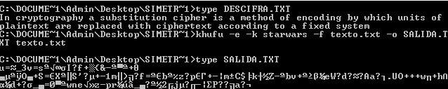
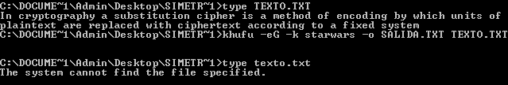
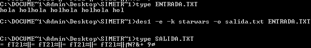

#Sesión 3 SPSI. Algoritmos simétricos.

##Clasificación de algoritmos

| Clásicos   | Flujo     |  Bloque     |
| :------------- | :------------- | :------------ |
| César      | Enigma   | Blowfish(64b) |
|  Vigenere  |  OTPCCD  | DES  |
| Rot13      |  OTPCF   | Triple DES |
| Transpos   | OTPF     | IDEA |
|            | XOR      |  KHUFU|
|            | Random   |  Lucifer |
|            |          | TinyRSA(8b)  |
|            |          |          |

##Ejemplos de uso

Texto:
"In cryptography, a substitution cipher is a method of encoding by which units of plaintext are replaced with ciphertext, according to a fixed system"

#Cifradores clásicos

César

Este cifrado no necesita llave.

Transposición

Para descifrar se usa de la misma manera pero con la opción -d

Este cifrado necesita una llave que es la dimensión de una matriz en filas y columnas, siendo el tamaño del texto elegido igual a filas*columnas.

#Cifradores de Flujo

Enigma

La llave tiene que tener el formato

Con ella ciframos el texto

#Cifrado modo Bloque

Blowfish CBC

En este caso se necesita que el archivo origen del cifrado y destino del descifrado sean el mismo.

La llave es un string de hasta 72 caracteres. Puedes elegir un texto y cogerá solo los 72 primeros y además utiliza un vector inicializador sacado a partir del nombre del fichero que se cifra.

#KHUFU

La  llave es de hasta 256 caracteres. Al igual que blowfish se el archivo que se cifra y el archivo donde se descifra deben ser el mismo.

## Borrado Seguro

Si deseamos que el archivo a cifrar se destruya una vez cifrado podemos usar un borrado seguro, que nos permite asegurar que no se pueda obtener el texto original de la fuente.

Por ejemplo usamos el algoritmo KHUFU

## Tamaño de algoritmos de cifrado por bloques

Blowfish, DES, triple DES, IDEA, KHUFU y Lucifer usan tamaño 64 bits, mientras que tinyRSA usa bloques de 8 bits

## Cifrado XOR

Cuando usamos el cifrado XOR tenemos la particularidad que si ciframos un texto con la misma llave dos veces nos devuelve el mensaje original. En el caso de usar como llave una cadena de caracteres espacios de la misma longitud que el texto, nos devuelve lo que eran minúsculas como mayúsculas y viceversa, ya que el espacio tiene el código 0X20.

## Cifrado modo ECB y CBC

En el repertorio de algoritmos que podemos usar hay unos que tienen dos versiones, una que acaba con \_C y otra sin. La primera es encadenada la forma en que se cifran los algoritmos, queriendo decir, que la salida del bloque anterior se usa para cifrar el bloque siguiente. En caso de ECB no se hace y podemos ver el problema que puede aparecer con la redundancia en el mensaje. Por ejemplo,

muestra que cada 64 bits se repiten los caracteres en el criptograma. Esto es un problema y por tanto es mejor usar CBC para que no suceda.

##Anotaciones al final

En caso de que el texto a cifrar no sea múltiplo del tamaño de bloque que use el algoritmo, se debe de añadir tantos bits hasta llegar a que sea múltiplo. Esto se ve muy bien con un ejemplo,

En este ejemplo, ciframos la palabra pedro, que son 5 caracteres, y nos devuelve 8 caracteres que es el tamaño de bloque que usa el algoritmo des1.

Por tanto, el tamaño del archivo cifrado será un múltiplo del tamaño del bloque y mayor o igual que el tamaño del archivo sin cifrar.
