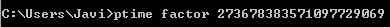
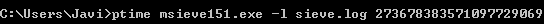
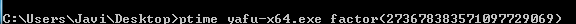
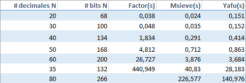
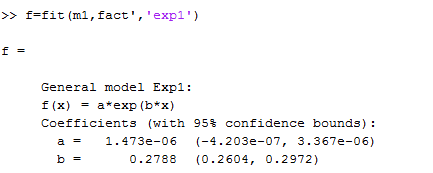
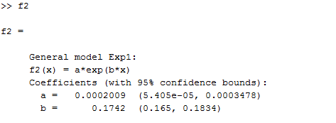
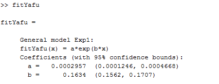
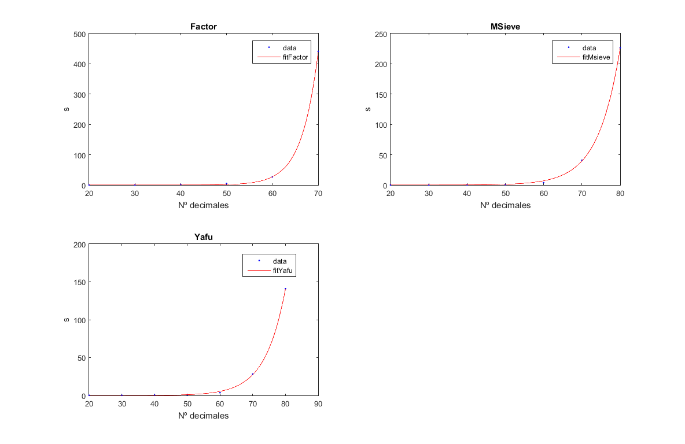
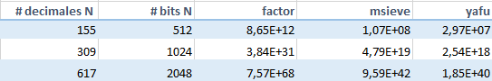
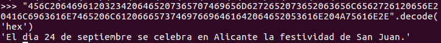

#Sistemas de clave pública: simulación y ataques.

## Factorización de claves

El objetivo de esta práctica es usar distintas herramientas para atacar llaves públicas de tipo RSA. Lo que tratamos es de encontrar los factores del módulo N para poder obtener entonces el valor de Euler y hallar la inversa de la llave de cifrado.

### Programas: factor, msieve y yafu.

La forma de utilizar los programas es la siguiente

Para estos programas se ha hecho un estudio del tiempo que tardan en factorizar módulos tipo RSA. Para ello hemos generado los valores del módulo N a partir del tamaño que deseamos, 20 decimales,30, ..., así hasta 80.  

* Vemos el tiempo que tarda cada programa en factorizar los distintos valores.

* Ahora lo que queremos es saber cuanto tiempo se necesita para una determinada longitud de N. Por ello calculamos con matlab las funciones de ajuste(*fit*).

* A partir de las funciones podemos obtener los tiempos necesarios para factorizar un número cualquiera con X decimales. Tan solo tenemos que indicar el número de decimales. En nuestro caso probamos para  155(512 bits), 309(1024 bits) y 618(2048 bits)

###Laboratorio criptografía de llave pública.

Para realizar el experimento necesitamos calcular el módulo como producto de 2 números primos. Para asegurarnos que no puedan usarse los ataques de factorización o logaritmo discreto, escogemos números primos de 100 decimales, así N tendrá 200 decimales. En este caso hemos elegido como

* p = 9523123566165979956539496862089252455661149862597756977828060038070484375676928088038209400685711517

* q = 16549994546965180580358853582751497652816927053361466124744209987155829699967224768546094607630261449

p y q se han calculado usando DisMat

* N = p*q = 157607643090122572341895146022586289602072322373765073552949758015743907941463310723299395141855357480619698352726641990417705619691873953910316578993402747353816810959088162232183641633086953300408133

* e = 13551733 (siendo primo relativo de N-1)

Para calcular e se ha tratado de factorizar N-1 usando *yafu* y deteniendo el proceso al rato. Así calcula algún factor y podemos guiarnos a la hora de la elección.

Con estos valores pasamos a cifrar un texto usando *ExpoCrip*. El resultado es

C = 456C20646961203234206465207365707469656D6272652073652063656C6562726120656E20416C6963616E7465206C6120666573746976696461642064652053616E204A75616E2E

Ahora usamos la opción de descifrar con los parámetros que tenemos

Pero vemos que nos devuelve un hexadecimal y podemos pensar que no debería devolver ese resultado, pero es el correcto. Para comprobarlo podemos usar el lenguaje *python* y pasar de hexadecimal a ascii.

Ahora si que podemos leer el mensaje
