#Sistemas híbridos: PGP parte 1 de 2.

##PGP 8.0.Primeros pasos.

Lo primero que vamos a hacer para utilizar la herramienta es crear un par de
claves públicas privadas.

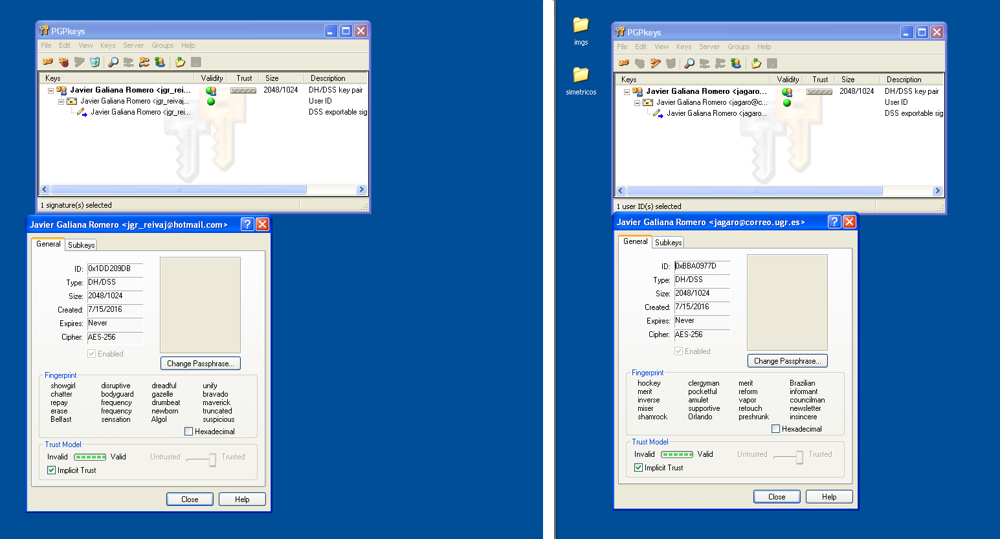

En este caso creamos dos anillos de llaves(*key rings*) que son donde estarán
almacenadas nuestras llaves públicas/privadas además de las llaves públicas que
vayamos obteniendo. La finalidad es el cifrar mensajes con la llave pública del
receptor del mensaje y así, sólo él pueda descifrar el mensaje.

Para que otros puedan usar nuestra llave pública lo que debemos de hacer es
exportar la llave

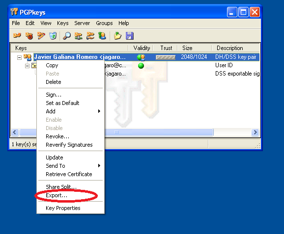

Pero ojo, lo que buscamos es compartirla y por lo tanto, no debe de estar
seleccionado el incluir la llave privada. Esto lo haríamos en caso de querer
tener una copia y guardarla en un sitio distinto.

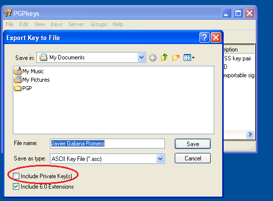

Lo siguiente que hacemos es intercambiar nuestras llaves con quien queramos y
añadir las llaves públicas a nuestro anillo.

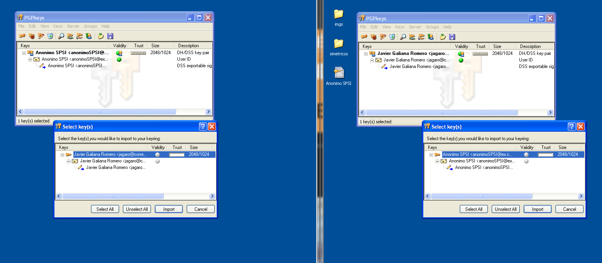

A partir de este momento podemos enviar mensajes entre los dos sistemas.

##Uso de servidores de llaves PGP

Algo de utilidad es que esta llave pueda usarse a nivel global y esté a
disposición de cuaquiera que lo desee, para así poder identificarnos en la red
o que nos envíen mensajes cifrados. Para ello existen los servidores de llaves
PGP. Todos tienen un comportamiento similar y además de poder añadir llaves, se
pueden borrar o actualizar. Esto viene bien en caso de que nuestra llave ya no
sea válida porque hayamos perdido la llave privada o nuestra llave haya sido
comprometida.

Para el ejemplo se han usado los servidores de *rediris PGP server* y *MIT PGP
server*

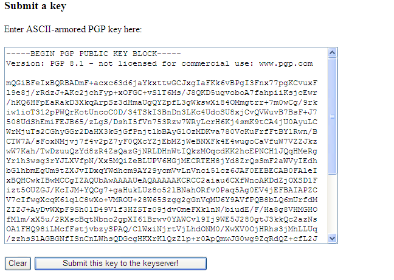

##Cifrado, firma y borrado de mensajes con PGPmail

Una vez que tenemos la llave pública del destinatario de nuestro mensaje cifrado
solo tenemos que hacer uso de la aplicación **PGPmail**

Podemos cifrar, firmar o cifrar y firmar. Si elegimos cifrar o cifrar y firmar
nos aparecerá la siguiente pantalla

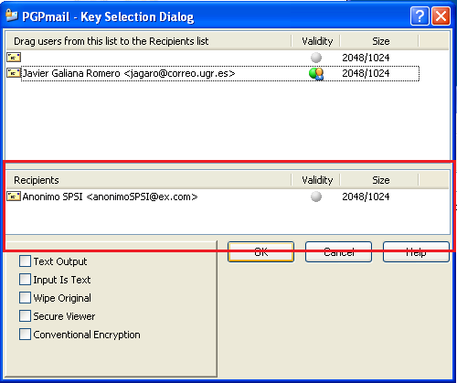

Lo único que hay que hacer es escoger la llave pública del cuadro de arriba y
arrastrarla al cuadro de abajo(*recipients*). En este caso usamos la que se ve.

Después de haberlo cifrado se lo pasamos al receptor y este al tratar de abrirlo
y teniendo instalado también *PGP 8.0* verá que le aparece la siguiente pantalla.

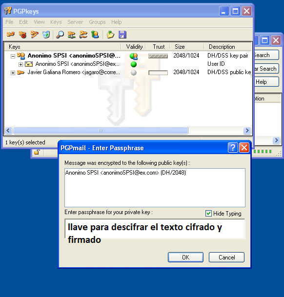

Más que nada te pide la *keyphrase* usada para generar la llave pública/privada.
Para poder descifrar un mensaje se debe de tener la llave privada y además
conocer la keyphrase que se ha utilizado.

En caso de que hayamos elegido la opción de cifrar y firmar, después de haber
introducido la *keyphrase* nos muestra quien ha sido el que lo ha firmado.

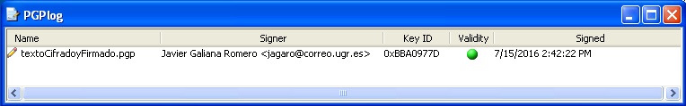

## Uso de grupos con PGP

Todo lo explicado hasta el momento es para la comunicación 1 es a uno, pero
cuando el destinatario del mensaje son varios tenemos la posibilidad de crear
grupos. Dichos grupos se usan a la hora de cifrar mensajes y por lo tanto, todo
el que forme parte del grupo podrá descifrarlo. Esto se hace muy fácil.

En la barra de arriba elegimos la opción de *Groups* y creamos un grupo, que
aparece al momento en el recuadro de abajo. Cuando queremos añadir usuarios
simplemente tenemos que arrastrarlo del área de llaves que tenemos y soltarlo en
el grupo. El resultado es el siguiente

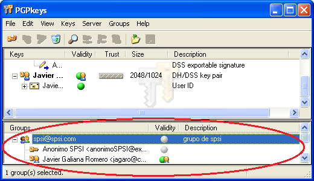

Ahora cuando vamos a cifrar un mensaje nos aparece en la lista el grupo, el cual
usamos como recepiente.

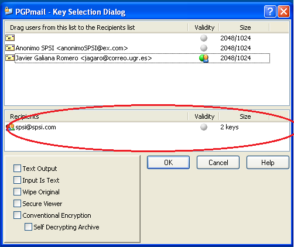

Cuando se trata de descifrarlo nos aparecen la lista de todos los usuarios que
pueden hacerlo.

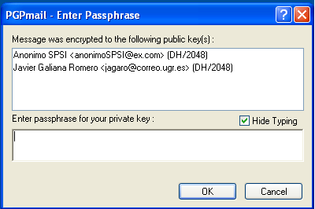

Para hacer más fácil la distribución del mensaje, podemos usar un gestor de
correo electrónico como *Thunderbird*. Y crear un grupo en la libreta de
direcciones.

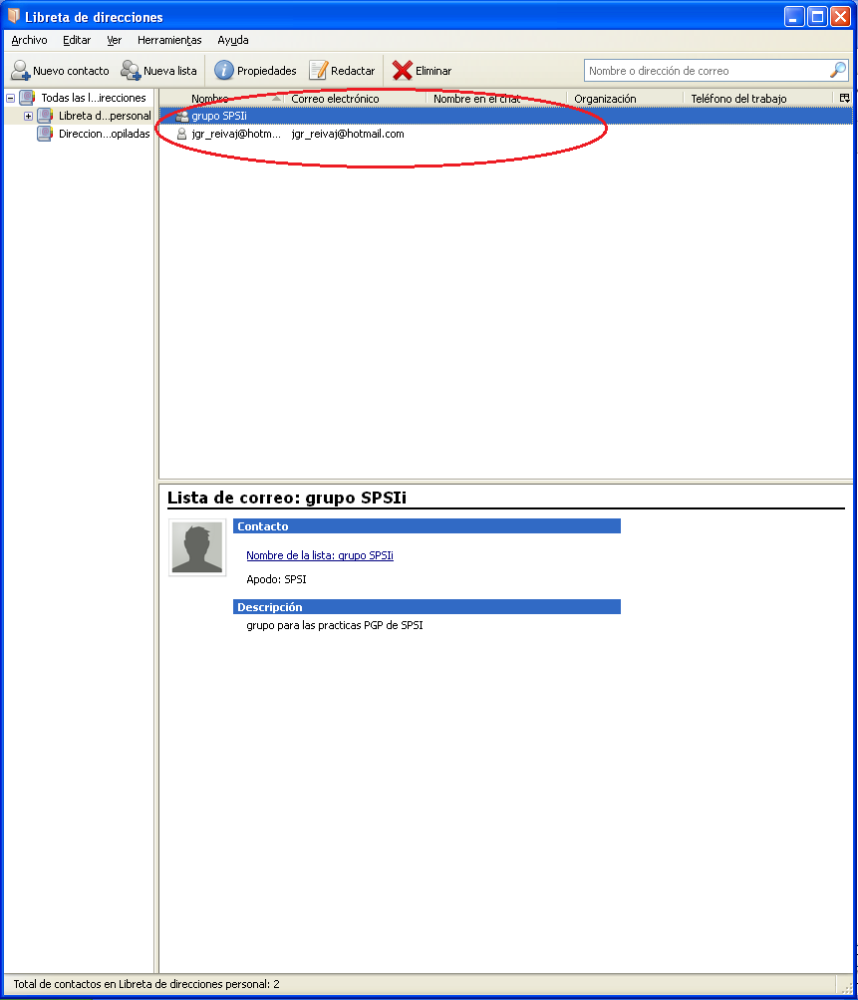

## Opciones

En este apartado se muestran las posibilidades que ofrecen las distintas
herramientas del programa.

En caso de que tengamos la llave pública de alguien que conocemos podemos
validarla y para ello debemos de firmarla. Pulsando el botón derecho sobre
la llave y eligiendo *sign* la validamos.

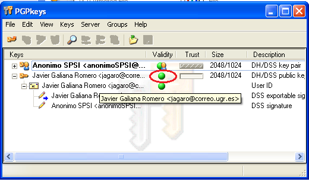

Si vemos las opciones del llave podemos ver que tiene dos campos *fingerprint* y
*Trust model*. El primero nos indica el *hash* de la llave y nos permite
comprobar si un archivo ha sido firmado por el usuario o si la llave que
poseemos es la que está en vigor.

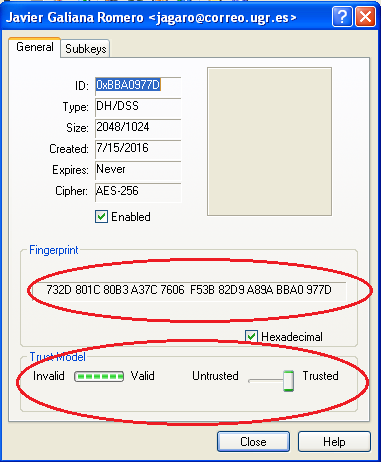

Si elegimos en el recuadro la pestaña *subkeys* veremos las subllaves que se
pueden utilizar para cifrar mensajes. En caso de que quitemos una subllave ya no
se podrá usar para cifrar mensajes y una vez redistribuída no volverá a poder
usarse.

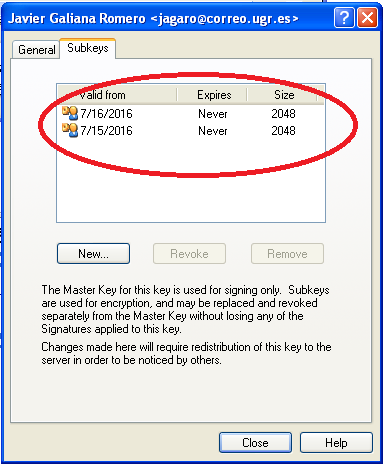)

Cuando ciframos un mensaje podemos configurar el cifrado

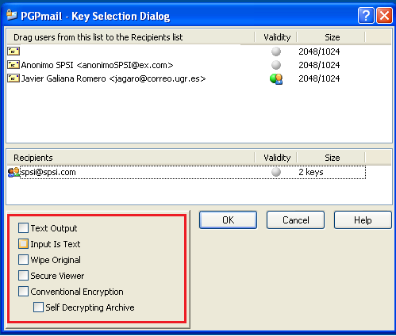

Por defecto se cifra en binario, pero si elegimos la opción *Text output* el
archivo binario se convierte en ASCII. Esto se puede comprobar abriendo ambos
archivos resultantes. Principalmente se usa la opción para que sea más amigable
para herramientas como las de mensajería. *Wipe original* se usa para eliminar
el archivo que va a ser cifrado al finalizar el cifrado. *Conventional
encryption* es para cifrar usando un cifrado simétrico y por lo tanto, hay que
introducir una llave privada de cifrado que deberá conocer el que desee
descifrar el archivo.

Finalmente, cuando firmamos un archivo podemos generar una llave para el archivo.
Para ello usamos la opción *detached signature* que nos proporciona la firma,
en binario o en texto ASCII si elegimos *output text*.

.
