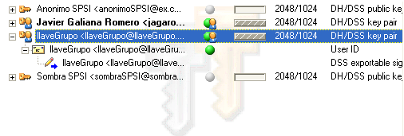

#Sesión 6. Sistemas híbridos: PGP parte 2 de 2.

## Partir una llave pública/privada

Con PGP 8.1 podemos crear una llave y dividirla en varias partes que serán producidas para
distintos usuarios de los que tengamos su llave pública. También podemos usar usuarios
que creamos usando para ellos una llave, en este caso sería un cifrado simétrico, ya que
se usa una llave secreta para el cifrado.

A partir de aquí empezamos el desarrollo práctico.

## Creación y fragmentación de una llave.

El planteamiento seguido para la práctica es tener 3 usuarios con llave pública/privada
y un usuario que denominamos local y que usa una llave secreta. Con este esquema
elegimos uno de los usuarios del primer grupo como el administrador, y es el
encargado de crear la llave pública/privada a trocear.

Con la llave creada, ciframos un archivo cualquiera que será el que descifremos al
final. Ahora tenemos que fragmentar la llave.

En el diálogo que aparece debemos de elegir las personas que recibirán un trozo.
La forma es arrastrando cada usuario de la pantalla de *PGPKeys*. Por último,
creamos un usuario *local* al cual hay que proporcionar la llave secreta.

Pulsamos *split key*, y nos pide el lugar donde guardar las partes.

Una vez las tenemos procedemos a entregarlas a sus destinatarios. Para ello podemos
usar el gestor de correo utilizado en la sesión anterior y enviar cada parte a su dueño.
A la vez que se envían el admin debe de borrar esa llave.

El siguiente paso es la reconstrucción de la llave cuando tratamos de descifrar
el mensaje cifrado al comienzo.

## Reconstrucción de una llave

Se abre el archivo que fue cifrado con la llave que se fracciona.

Se añaden las fracciones que tengamos con *Select Share File* y se inicia la conexión.
En este caso tenemos 2 llaves y con una más sería necesario para descifrar el archivo.
Por ello, uno de los poseedores de la llave debe de enviar su parte. Esto se logra
mediante el en *File -> Send Key File*. Lo único que necesitamos es conocer la dirección
de la persona que tiene el rol de *admin*.

Cuando ambas se conectan reciben un mensaje donde aparece los datos de la persona
que envía la fracción. Como tenemos su llave pública en el *keyring* podemos
ver si es de quien la esperábamos.

Aceptamos la transferencia y ya tenemos 3 de las 4 llaves, por lo que podemos descifrar
el mensaje.

